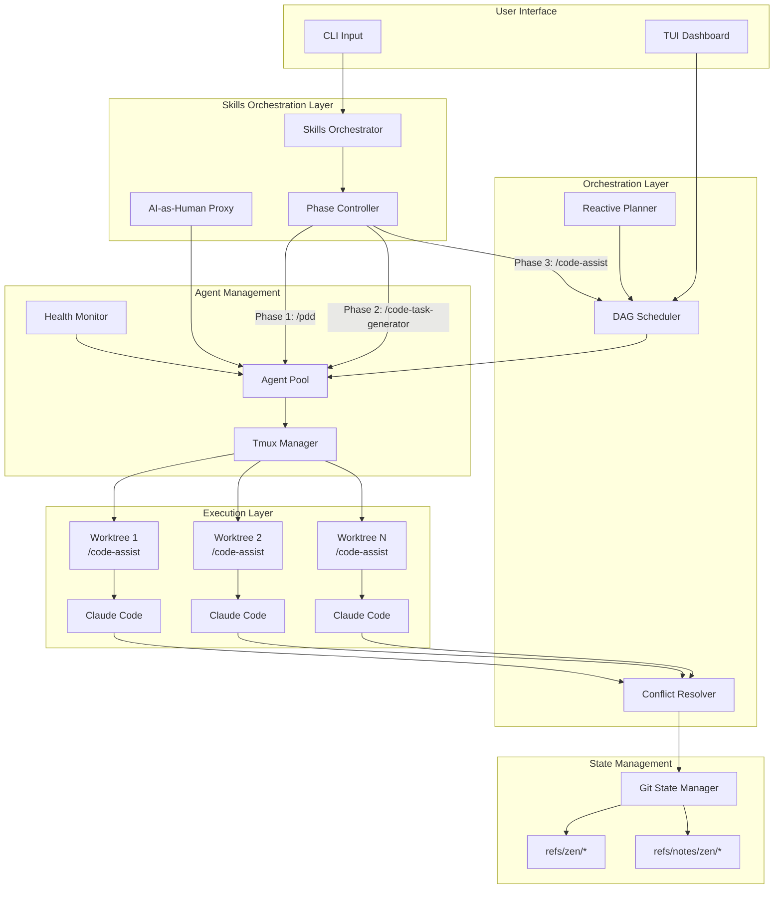
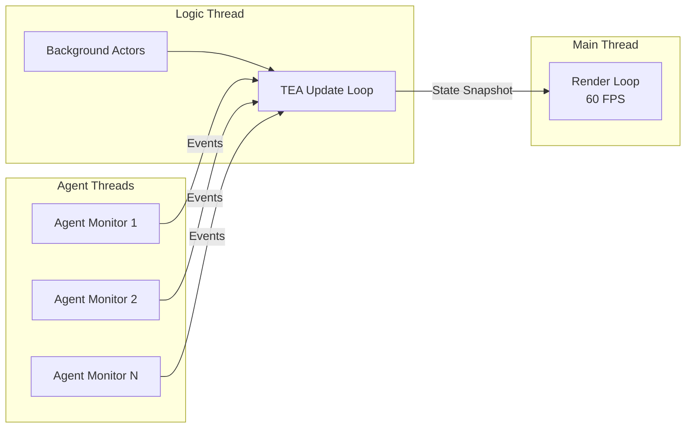

# Zen v2: Parallel AI Agent Orchestrator - Detailed Design

**Version:** 1.0
**Date:** 2026-01-30
**Status:** Draft

---

## 1. Overview

Zen v2 is a complete Rust rewrite of the Ralph autonomous development loop, transforming it from a sequential bash orchestrator into a parallel, multi-agent system. The core philosophy is "scrappy sledgehammer" - lightweight but insanely powerful.

### 1.1 Vision

Zen orchestrates multiple Claude Code agents working in parallel across git worktrees, with AI-driven dependency inference, automatic conflict resolution, and a reactive planning system that adapts when plans change.

### 1.2 Key Differentiators

| Feature | Ralph (Current) | Zen v2 (Target) |
|---------|-----------------|-----------------|
| Execution | Sequential | Parallel via DAG |
| Language | 114 lines bash | Rust binary |
| Agents | Single instance | Multiple concurrent |
| State | progress.txt + JSON | Git-native (refs/notes) |
| UI | Text output | TUI (htop-style) |
| Isolation | None | Git worktrees |
| Conflict Resolution | Manual | AI-assisted |
| Planning | Static | Reactive (auto-replan) |

### 1.3 Design Principles

1. **Scrappy Sledgehammer**: Lightweight but powerful; no over-engineering
2. **Git-Native**: All state in git (refs, notes, commits) - portable, versioned
3. **AI-First**: Use AI judgment for dependency inference, conflict resolution, error recovery
4. **Spawn, Don't Reimplement**: Leverage existing CLIs (Claude Code) rather than reimplementing
5. **Reactive**: System adapts when plans/designs change mid-execution
6. **Skills-Driven**: Orchestrate via hardcoded Skills (/pdd, /code-task-generator, /code-assist), not raw prompts
7. **Preserve Architecture**: Build on existing decoupled game loop - don't reinvent

### 1.4 Critical Architectural Constraint

**The existing Zen architecture MUST be preserved:**
- Two-thread decoupled game loop (render @ 60 FPS + logic via Tokio)
- TEA pattern (Model, Message, Command, Update)
- Background actor system with cancellation tokens
- Lock-free state transfer via bounded channel
- Existing modules: GitRefs, GitNotes, Session, Tmux, Agent

Zen v2 extends this foundation with orchestration capabilities, not replaces it.

### 1.5 Skills-Driven Workflow (Key Innovation)

Instead of Zen implementing its own planning/coding logic, it orchestrates **existing Skills** with **AI playing the role of the human**:

```
┌─────────────────────────────────────────────────────────────────┐
│                     ZEN ORCHESTRATION FLOW                      │
├─────────────────────────────────────────────────────────────────┤
│                                                                 │
│  User: "zen 'build user authentication'"                        │
│                           │                                     │
│                           ▼                                     │
│  ┌─────────────────────────────────────────────────────────┐   │
│  │  PHASE 1: /pdd                                          │   │
│  │  - Zen spawns agent with /pdd skill                     │   │
│  │  - AI-as-Human answers clarification questions          │   │
│  │  - Output: detailed-design.md + plan.md                 │   │
│  └─────────────────────────────────────────────────────────┘   │
│                           │                                     │
│                           ▼                                     │
│  ┌─────────────────────────────────────────────────────────┐   │
│  │  PHASE 2: /code-task-generator                          │   │
│  │  - Zen feeds PDD output to code-task-generator          │   │
│  │  - AI-as-Human approves/adjusts task breakdown          │   │
│  │  - Output: .code-task.md files for each step            │   │
│  └─────────────────────────────────────────────────────────┘   │
│                           │                                     │
│                           ▼                                     │
│  ┌─────────────────────────────────────────────────────────┐   │
│  │  PHASE 3: /code-assist (PARALLEL)                       │   │
│  │  - Zen spawns parallel agents, each in own worktree     │   │
│  │  - Each agent runs /code-assist on assigned task        │   │
│  │  - AI-as-Human mode: auto, minimal interaction          │   │
│  │  - Output: implemented code, tests, commits             │   │
│  └─────────────────────────────────────────────────────────┘   │
│                           │                                     │
│                           ▼                                     │
│  ┌─────────────────────────────────────────────────────────┐   │
│  │  PHASE 4: Merge & Resolve                               │   │
│  │  - Zen merges completed worktrees to staging            │   │
│  │  - Conflict resolver agent handles merge conflicts      │   │
│  │  - Output: unified staging branch                       │   │
│  └─────────────────────────────────────────────────────────┘   │
│                           │                                     │
│                           ▼                                     │
│  ┌─────────────────────────────────────────────────────────┐   │
│  │  PHASE 5: /codebase-summary (Optional)                  │   │
│  │  - Update documentation with new components             │   │
│  │  - Output: updated AGENTS.md, README.md                 │   │
│  └─────────────────────────────────────────────────────────┘   │
│                                                                 │
└─────────────────────────────────────────────────────────────────┘
```

### 1.6 AI-as-Human Pattern

Skills like /pdd are interactive - they ask clarifying questions one at a time. Zen implements an **AI-as-Human** layer that answers these questions autonomously:

```rust
/// AI-as-Human: Answers skill questions on behalf of the user
pub struct AIHumanProxy {
    /// Original user intent/prompt
    original_prompt: String,
    /// Context accumulated from conversation
    context: ConversationContext,
    /// Model to use for generating answers
    model: String,
}

impl AIHumanProxy {
    /// Generate answer to a skill's question
    pub async fn answer_question(&self, question: &str) -> String {
        let prompt = format!(
            "You are acting as a human user who requested: '{}'

            The AI assistant is asking you this clarification question:
            {}

            Based on the original request and common best practices,
            provide a reasonable answer. Be concise and decisive.
            If the question offers options, pick the most sensible one.

            Previous context:
            {}",
            self.original_prompt,
            question,
            self.context.summary()
        );

        // Use a lightweight model for quick responses
        self.query_model(&prompt).await
    }
}
```

**Key behaviors:**
- Answers based on original user intent + accumulated context
- Makes reasonable decisions (picks sensible defaults)
- Can escalate truly ambiguous questions to real user
- Tracks conversation for consistent follow-up answers

---

## 2. Detailed Requirements

*Consolidated from requirements clarification (idea-honing.md)*

### 2.1 Core Functionality

| Requirement | Description | Priority |
|-------------|-------------|----------|
| **R1** | Parallel task execution via DAG-based scheduler | Must Have |
| **R2** | Git worktree isolation per agent | Must Have |
| **R3** | AI-inferred task dependencies | Must Have |
| **R4** | Spawn Claude Code agents in tmux panes | Must Have |
| **R5** | Git-native state persistence (refs/notes) | Must Have |
| **R6** | TUI dashboard with keyboard navigation | Must Have |
| **R7** | Reactive planning (auto-replan on changes) | Must Have |
| **R8** | AI-assisted merge conflict resolution | Must Have |
| **R9** | Skills integration (agents choose when to use) | Must Have |
| **R10** | Headless mode for meta-orchestration | Must Have |

### 2.2 Quality of Life

| Requirement | Description | Priority |
|-------------|-------------|----------|
| **R11** | Auto-cleanup merged worktrees | Must Have |
| **R12** | Agent health monitoring (stuck detection) | Must Have |
| **R13** | Direct agent chat (attach to pane) | Should Have |
| **R14** | Cost tracking and budgets | Nice to Have |
| **R15** | Pause/resume agents | Nice to Have |

### 2.3 Out of Scope (v1)

- Multi-agent providers (Claude Code only; pluggable adapter for future)
- Cost tracking/budgets
- Web UI (TUI only)
- Remote/distributed execution
- CI/CD integration (GitHub Actions, webhooks)

### 2.4 User Workflow

```
User Journey:
1. zen "build user authentication"     # Natural language input
2. [Zen analyzes, infers dependencies, creates DAG]
3. [Zen spawns agents in parallel worktrees]
4. [User goes to do other work]
5. [Zen completes, merges to staging branch]
6. zen review                          # User reviews summary
7. zen accept                          # Merge to main
```

---

## 3. Architecture Overview

### 3.1 High-Level Architecture



### 3.2 Component Overview

| Component | Responsibility |
|-----------|----------------|
| **CLI** | Parse commands, headless mode support |
| **TUI** | Real-time dashboard, agent status, keyboard navigation |
| **Skills Orchestrator** | Hardcoded workflow: /pdd → /code-task-generator → /code-assist |
| **AI-as-Human Proxy** | Autonomously answer skill clarification questions |
| **Phase Controller** | Manage transitions between workflow phases |
| **Reactive Planner** | Parse input, generate/update task DAG, respond to changes |
| **DAG Scheduler** | Topological execution, parallel dispatch, dependency tracking |
| **Agent Pool** | Manage agent lifecycle, spawn/monitor/terminate |
| **Health Monitor** | Detect stuck agents, auto-restart, circuit breakers |
| **Tmux Manager** | Session/pane management, attach/detach |
| **Conflict Resolver** | AI-assisted merge conflict resolution |
| **Git State Manager** | Worktree CRUD, refs/notes state persistence |

### 3.3 Thread Architecture

Building on existing Zen architecture (decoupled game loop):



**Thread Responsibilities:**
- **Main Thread**: 60 FPS render loop (no blocking)
- **Logic Thread**: Tokio runtime, TEA updates, command execution
- **Agent Threads**: Per-agent monitoring (output capture, health checks)

---

## 4. Components and Interfaces

### 4.1 CLI Interface

```rust
/// CLI command structure
pub enum Command {
    /// Start orchestration with natural language task
    Run {
        #[arg(short, long)]
        prompt: String,

        #[arg(short, long)]
        headless: bool,
    },

    /// Review completed work
    Review,

    /// Accept and merge to main
    Accept {
        #[arg(long)]
        task_id: Option<String>,
    },

    /// Reject and rollback
    Reject {
        task_id: String,
    },

    /// Attach to agent pane
    Attach {
        agent_id: String,
    },

    /// Show status
    Status,

    /// Reset all state
    Reset {
        #[arg(long)]
        force: bool,
    },
}
```

### 4.2 Skills Orchestrator (Core Innovation)

```rust
/// The hardcoded Skills-driven workflow
pub struct SkillsOrchestrator {
    ai_human: AIHumanProxy,
    phase_controller: PhaseController,
    agent_pool: Arc<RwLock<AgentPool>>,
    state: Arc<RwLock<WorkflowState>>,
}

/// Workflow phases
#[derive(Debug, Clone, PartialEq)]
pub enum WorkflowPhase {
    /// Phase 1: Run /pdd to generate design and plan
    Planning,
    /// Phase 2: Run /code-task-generator to create tasks
    TaskGeneration,
    /// Phase 3: Run /code-assist in parallel for each task
    Implementation,
    /// Phase 4: Merge worktrees and resolve conflicts
    Merging,
    /// Phase 5: Optional /codebase-summary for documentation
    Documentation,
    /// All phases complete
    Complete,
}

impl SkillsOrchestrator {
    /// Execute the full workflow from user prompt
    pub async fn execute(&self, prompt: &str) -> Result<WorkflowResult> {
        // Initialize workflow state
        self.state.write().await.initialize(prompt);

        // PHASE 1: Planning with /pdd
        self.phase_controller.transition(WorkflowPhase::Planning);
        let pdd_result = self.run_pdd_phase(prompt).await?;

        // PHASE 2: Task Generation with /code-task-generator
        self.phase_controller.transition(WorkflowPhase::TaskGeneration);
        let tasks = self.run_task_generation_phase(&pdd_result).await?;

        // PHASE 3: Parallel Implementation with /code-assist
        self.phase_controller.transition(WorkflowPhase::Implementation);
        let impl_results = self.run_implementation_phase(&tasks).await?;

        // PHASE 4: Merge and Resolve
        self.phase_controller.transition(WorkflowPhase::Merging);
        self.run_merge_phase(&impl_results).await?;

        // PHASE 5: Documentation (optional)
        if self.state.read().await.config.update_docs {
            self.phase_controller.transition(WorkflowPhase::Documentation);
            self.run_documentation_phase().await?;
        }

        self.phase_controller.transition(WorkflowPhase::Complete);
        Ok(self.state.read().await.result())
    }

    /// Phase 1: Run /pdd skill with AI-as-Human answering questions
    async fn run_pdd_phase(&self, prompt: &str) -> Result<PDDResult> {
        let agent = self.agent_pool.write().await.spawn_for_skill("pdd").await?;

        // Send initial prompt to trigger /pdd
        agent.send(&format!("/pdd\n\nrough_idea: {}", prompt)).await?;

        // Monitor agent output and answer questions via AI-as-Human
        loop {
            match agent.read_output().await? {
                AgentOutput::Question(q) => {
                    let answer = self.ai_human.answer_question(&q).await;
                    agent.send(&answer).await?;
                }
                AgentOutput::Completed => break,
                AgentOutput::Error(e) => return Err(e.into()),
                _ => continue,
            }
        }

        // Parse PDD artifacts
        Ok(PDDResult::from_directory(&agent.worktree_path().join(".sop/planning"))?)
    }

    /// Phase 2: Run /code-task-generator
    async fn run_task_generation_phase(&self, pdd: &PDDResult) -> Result<Vec<CodeTask>> {
        let agent = self.agent_pool.write().await.spawn_for_skill("code-task-generator").await?;

        // Feed PDD plan to code-task-generator
        let plan_path = pdd.plan_path.display();
        agent.send(&format!("/code-task-generator\n\ninput: {}", plan_path)).await?;

        // AI-as-Human approves task breakdown
        loop {
            match agent.read_output().await? {
                AgentOutput::Question(q) => {
                    let answer = self.ai_human.answer_question(&q).await;
                    agent.send(&answer).await?;
                }
                AgentOutput::Completed => break,
                AgentOutput::Error(e) => return Err(e.into()),
                _ => continue,
            }
        }

        // Parse generated code tasks
        Ok(CodeTask::from_directory(&agent.worktree_path())?)
    }

    /// Phase 3: Run /code-assist in parallel for independent tasks
    async fn run_implementation_phase(&self, tasks: &[CodeTask]) -> Result<Vec<ImplResult>> {
        // Build DAG from tasks (AI-inferred dependencies)
        let dag = self.build_task_dag(tasks).await?;

        // Execute DAG with parallel /code-assist agents
        let mut results = Vec::new();
        let mut completed = HashSet::new();

        while !dag.all_complete(&completed) {
            let ready = dag.ready_tasks(&completed);

            // Spawn agents for ready tasks (each in own worktree)
            let handles: Vec<_> = ready.iter().map(|task| {
                let pool = self.agent_pool.clone();
                let task = task.clone();
                let ai_human = self.ai_human.clone();

                tokio::spawn(async move {
                    let agent = pool.write().await
                        .spawn_for_task(&task, "code-assist").await?;

                    // Run /code-assist with auto mode
                    agent.send(&format!(
                        "/code-assist\n\ntask_description: {}\nmode: auto",
                        task.description
                    )).await?;

                    // Minimal interaction in auto mode
                    loop {
                        match agent.read_output().await? {
                            AgentOutput::Question(q) => {
                                // Even in auto mode, some questions may arise
                                let answer = ai_human.answer_question(&q).await;
                                agent.send(&answer).await?;
                            }
                            AgentOutput::Completed => break,
                            AgentOutput::Error(e) => return Err(e.into()),
                            _ => continue,
                        }
                    }

                    Ok::<_, Error>(ImplResult {
                        task_id: task.id.clone(),
                        worktree: agent.worktree_path(),
                        commit: agent.last_commit()?,
                    })
                })
            }).collect();

            // Wait for this batch to complete
            for handle in handles {
                let result = handle.await??;
                completed.insert(result.task_id.clone());
                results.push(result);
            }
        }

        Ok(results)
    }
}

/// AI-as-Human: Answers skill questions autonomously
#[derive(Clone)]
pub struct AIHumanProxy {
    original_prompt: String,
    context: Arc<RwLock<ConversationContext>>,
    model: String,  // Use fast model like haiku for responses
}

impl AIHumanProxy {
    pub async fn answer_question(&self, question: &str) -> String {
        let context = self.context.read().await;

        let prompt = format!(
            r#"You are acting as a decisive human user who originally requested:
"{}"

The AI assistant is now asking you this clarification question:
{}

INSTRUCTIONS:
- Answer based on the original request and software engineering best practices
- Be CONCISE and DECISIVE - pick the most sensible option
- If given numbered options, respond with just the number
- If asked yes/no, respond with just "yes" or "no"
- If asked for a name/value, provide a reasonable one
- Don't explain your reasoning, just answer

Previous conversation context:
{}

YOUR ANSWER:"#,
            self.original_prompt,
            question,
            context.summary()
        );

        let answer = self.query_model(&prompt).await;

        // Record Q&A in context for consistency
        self.context.write().await.record(question, &answer);

        answer
    }

    /// Detect if a question is too ambiguous and needs human escalation
    pub fn needs_escalation(&self, question: &str) -> bool {
        // Heuristics for questions that need real human input
        let ambiguous_patterns = [
            "which approach do you prefer",
            "what style do you want",
            "personal preference",
            "there are multiple valid",
        ];

        ambiguous_patterns.iter().any(|p| question.to_lowercase().contains(p))
    }
}

/// Tracks conversation context for consistent AI-as-Human responses
pub struct ConversationContext {
    qa_history: Vec<(String, String)>,
    decisions: HashMap<String, String>,
}

impl ConversationContext {
    pub fn record(&mut self, question: &str, answer: &str) {
        self.qa_history.push((question.to_string(), answer.to_string()));

        // Extract key decisions for future reference
        if question.contains("name") {
            self.decisions.insert("naming_convention".into(), answer.into());
        }
        // ... more decision tracking
    }

    pub fn summary(&self) -> String {
        self.qa_history.iter()
            .map(|(q, a)| format!("Q: {}\nA: {}", q, a))
            .collect::<Vec<_>>()
            .join("\n\n")
    }
}
```

### 4.3 Task and DAG Models

```rust
use petgraph::graph::{DiGraph, NodeIndex};
use serde::{Deserialize, Serialize};
use uuid::Uuid;

/// Unique task identifier
#[derive(Debug, Clone, Hash, Eq, PartialEq, Serialize, Deserialize)]
pub struct TaskId(Uuid);

/// Task status in lifecycle
#[derive(Debug, Clone, Serialize, Deserialize)]
pub enum TaskStatus {
    Pending,
    Ready,        // Dependencies satisfied
    Running,
    Completed,
    Failed { error: String },
    Blocked { reason: String },
}

/// A single task in the execution DAG
#[derive(Debug, Clone, Serialize, Deserialize)]
pub struct Task {
    pub id: TaskId,
    pub name: String,
    pub description: String,
    pub status: TaskStatus,

    // Execution context
    pub worktree_path: Option<PathBuf>,
    pub branch_name: Option<String>,
    pub agent_id: Option<AgentId>,

    // Timing
    pub created_at: DateTime<Utc>,
    pub started_at: Option<DateTime<Utc>>,
    pub completed_at: Option<DateTime<Utc>>,

    // Results
    pub commit_hash: Option<String>,
    pub exit_code: Option<i32>,
}

/// The task dependency graph
pub struct TaskDAG {
    graph: DiGraph<Task, DependencyType>,
    task_index: HashMap<TaskId, NodeIndex>,
}

/// Type of dependency between tasks
#[derive(Debug, Clone, Serialize, Deserialize)]
pub enum DependencyType {
    /// Task B requires output of Task A
    DataDependency,
    /// Task B modifies files that Task A also modifies
    FileDependency { files: Vec<PathBuf> },
    /// AI-inferred semantic dependency
    SemanticDependency { reason: String },
}

impl TaskDAG {
    /// Get all tasks ready to execute (dependencies satisfied)
    pub fn ready_tasks(&self) -> Vec<&Task> { ... }

    /// Mark task complete and update dependents
    pub fn complete_task(&mut self, id: &TaskId) { ... }

    /// Add new task with dependencies
    pub fn add_task(&mut self, task: Task, deps: Vec<TaskId>) { ... }

    /// Recompute DAG when plan changes
    pub fn replan(&mut self, new_tasks: Vec<Task>) { ... }
}
```

### 4.3 Agent Management

```rust
/// Unique agent identifier
#[derive(Debug, Clone, Hash, Eq, PartialEq)]
pub struct AgentId(Uuid);

/// Agent status
#[derive(Debug, Clone)]
pub enum AgentStatus {
    Idle,
    Running { task_id: TaskId },
    Stuck { since: Instant, reason: String },
    Failed { error: String },
    Terminated,
}

/// An AI agent instance
pub struct Agent {
    pub id: AgentId,
    pub status: AgentStatus,
    pub tmux_session: String,
    pub tmux_pane: String,
    pub worktree_path: PathBuf,
    pub started_at: Instant,
    pub last_activity: Instant,
}

/// Manages pool of agents
pub struct AgentPool {
    agents: HashMap<AgentId, Agent>,
    max_concurrent: usize,
    event_tx: mpsc::Sender<AgentEvent>,
}

impl AgentPool {
    /// Spawn new agent for task
    pub async fn spawn(&mut self, task: &Task) -> Result<AgentId>;

    /// Terminate agent
    pub async fn terminate(&mut self, id: &AgentId) -> Result<()>;

    /// Get agent by ID
    pub fn get(&self, id: &AgentId) -> Option<&Agent>;

    /// Count active agents
    pub fn active_count(&self) -> usize;
}

/// Events from agents
#[derive(Debug)]
pub enum AgentEvent {
    Started { agent_id: AgentId, task_id: TaskId },
    OutputLine { agent_id: AgentId, line: String },
    Completed { agent_id: AgentId, exit_code: i32 },
    Failed { agent_id: AgentId, error: String },
    StuckDetected { agent_id: AgentId, duration: Duration },
}
```

### 4.4 Health Monitor

```rust
/// Configuration for health monitoring
pub struct HealthConfig {
    /// Time without output before considered stuck
    pub stuck_threshold: Duration,
    /// Max retries before giving up
    pub max_retries: u32,
    /// Patterns indicating stuck state
    pub stuck_patterns: Vec<String>,
}

/// Health monitor for agents
pub struct HealthMonitor {
    config: HealthConfig,
    agent_pool: Arc<RwLock<AgentPool>>,
    event_tx: mpsc::Sender<HealthEvent>,
}

impl HealthMonitor {
    /// Check all agents for health issues
    pub async fn check_all(&self) -> Vec<HealthEvent>;

    /// Determine recovery action using AI judgment
    pub async fn determine_recovery(&self, agent: &Agent) -> RecoveryAction;
}

/// Recovery actions for unhealthy agents
pub enum RecoveryAction {
    Restart,
    Reassign { to_agent: AgentId },
    Decompose { into_tasks: Vec<Task> },
    Escalate { message: String },
    Abort,
}
```

### 4.5 Reactive Planner

```rust
/// Watches for plan/design changes and triggers replanning
pub struct ReactivePlanner {
    dag: Arc<RwLock<TaskDAG>>,
    watch_paths: Vec<PathBuf>,
    watcher: notify::RecommendedWatcher,
}

impl ReactivePlanner {
    /// Parse natural language input into tasks
    pub async fn parse_input(&self, input: &str) -> Result<Vec<Task>>;

    /// Infer dependencies between tasks using AI
    pub async fn infer_dependencies(&self, tasks: &[Task]) -> Result<Vec<(TaskId, TaskId, DependencyType)>>;

    /// Handle plan file changes
    pub async fn on_plan_changed(&self, path: &Path) -> Result<()>;

    /// Replan and notify affected agents
    pub async fn replan(&self) -> Result<()>;
}
```

### 4.6 Conflict Resolver

```rust
/// Handles merge conflicts between agent worktrees
pub struct ConflictResolver {
    git_ops: GitOps,
    agent_pool: Arc<RwLock<AgentPool>>,
}

impl ConflictResolver {
    /// Attempt to merge worktree into staging
    pub async fn merge(&self, worktree: &Path) -> Result<MergeResult>;

    /// Resolve conflicts using dedicated resolver agent
    pub async fn resolve_conflicts(&self, conflicts: Vec<ConflictFile>) -> Result<()>;
}

#[derive(Debug)]
pub enum MergeResult {
    Success { commit: String },
    Conflicts { files: Vec<ConflictFile> },
    Failed { error: String },
}

#[derive(Debug)]
pub struct ConflictFile {
    pub path: PathBuf,
    pub ours: String,
    pub theirs: String,
    pub base: Option<String>,
}
```

### 4.7 Git State Manager

```rust
/// Manages all git-native state for Zen
pub struct GitStateManager {
    repo_path: PathBuf,
    refs: GitRefs,
    notes: GitNotes,
    ops: GitOps,
}

impl GitStateManager {
    // Worktree operations
    pub fn create_worktree(&self, task: &Task) -> Result<PathBuf>;
    pub fn remove_worktree(&self, path: &Path) -> Result<()>;
    pub fn list_worktrees(&self) -> Result<Vec<WorktreeInfo>>;

    // Task state (via git notes)
    pub fn save_task(&self, task: &Task) -> Result<()>;
    pub fn load_task(&self, id: &TaskId) -> Result<Option<Task>>;
    pub fn list_tasks(&self) -> Result<Vec<Task>>;

    // DAG state (via git refs)
    pub fn save_dag(&self, dag: &TaskDAG) -> Result<()>;
    pub fn load_dag(&self) -> Result<Option<TaskDAG>>;

    // Workflow state
    pub fn save_workflow(&self, workflow: &Workflow) -> Result<()>;
    pub fn load_workflow(&self, id: &WorkflowId) -> Result<Option<Workflow>>;
}
```

### 4.8 TUI Components

```rust
use ratatui::widgets::*;

/// Main application state for TUI
pub struct AppState {
    pub workflow: Option<Workflow>,
    pub tasks: Vec<Task>,
    pub agents: Vec<AgentView>,
    pub selected_agent: usize,
    pub mode: UIMode,
    pub notifications: VecDeque<Notification>,
}

pub enum UIMode {
    Dashboard,
    AgentDetail { agent_id: AgentId },
    TaskList,
    Help,
}

/// Render the main dashboard
pub fn render_dashboard(f: &mut Frame, state: &AppState) {
    let chunks = Layout::default()
        .direction(Direction::Vertical)
        .constraints([
            Constraint::Length(3),   // Header
            Constraint::Min(10),     // Agent list
            Constraint::Length(10),  // Preview pane
            Constraint::Length(3),   // Status bar
        ])
        .split(f.area());

    render_header(f, chunks[0], state);
    render_agent_list(f, chunks[1], state);
    render_preview(f, chunks[2], state);
    render_status_bar(f, chunks[3], state);
}
```

### 4.9 Skills Integration

```rust
/// Skill discovery and loading
pub struct SkillManager {
    skill_paths: Vec<PathBuf>,
    loaded_skills: HashMap<String, Skill>,
}

#[derive(Debug, Clone)]
pub struct Skill {
    pub name: String,
    pub description: String,
    pub version: String,
    pub content: String,  // Full SKILL.md content
}

impl SkillManager {
    /// Discover skills from configured paths
    pub fn discover(&mut self) -> Result<Vec<String>>;

    /// Load a skill by name
    pub fn load(&mut self, name: &str) -> Result<&Skill>;

    /// Get all available skill names
    pub fn available(&self) -> Vec<&str>;
}
```

---

## 5. Data Models

### 5.1 Git State Schema

```
refs/zen/
├── workflows/
│   └── {workflow-id}          # Points to workflow commit
├── tasks/
│   └── {task-id}              # Points to task branch HEAD
└── staging                    # Staging branch for completed work

refs/notes/zen/
├── workflows/                 # Workflow metadata (JSON)
├── tasks/                     # Task metadata (JSON)
└── agents/                    # Agent session metadata (JSON)
```

### 5.2 Workflow State (JSON in git notes)

```json
{
  "id": "wf-001",
  "name": "build-user-auth",
  "status": "running",
  "prompt": "Build user authentication with login, logout, and password reset",
  "created_at": "2026-01-30T10:00:00Z",
  "started_at": "2026-01-30T10:00:05Z",
  "tasks": ["task-001", "task-002", "task-003"],
  "dag_edges": [
    {"from": "task-001", "to": "task-003", "type": "data"},
    {"from": "task-002", "to": "task-003", "type": "semantic"}
  ],
  "completed_tasks": ["task-001"],
  "staging_branch": "zen/staging/wf-001"
}
```

### 5.3 Task State (JSON in git notes)

```json
{
  "id": "task-001",
  "workflow_id": "wf-001",
  "name": "create-user-model",
  "description": "Create User model with email, password hash, and timestamps",
  "status": "completed",
  "agent_id": "agent-abc123",
  "worktree_path": "/Users/alice/.zen/worktrees/task-001",
  "branch_name": "zen/task/task-001",
  "created_at": "2026-01-30T10:00:05Z",
  "started_at": "2026-01-30T10:00:10Z",
  "completed_at": "2026-01-30T10:05:30Z",
  "commit_hash": "a1b2c3d4e5f6",
  "exit_code": 0,
  "retries": 0
}
```

### 5.4 Agent State (JSON in git notes)

```json
{
  "id": "agent-abc123",
  "task_id": "task-001",
  "tmux_session": "zen_task-001_abc123",
  "status": "completed",
  "started_at": "2026-01-30T10:00:10Z",
  "last_activity": "2026-01-30T10:05:28Z",
  "output_lines": 1547,
  "health_checks": 12,
  "recovery_actions": []
}
```

---

## 6. Key Algorithms

### 6.1 Dependency Inference

```python
# Pseudocode for AI-driven dependency inference

def infer_dependencies(tasks: List[Task]) -> List[Dependency]:
    """
    Use AI to analyze task descriptions and infer dependencies.

    Inference rules:
    1. Database schema tasks before API tasks
    2. Model/type definitions before usage
    3. Core utilities before features using them
    4. Tests depend on implementation
    """

    prompt = f"""
    Analyze these tasks and identify dependencies:

    {format_tasks(tasks)}

    For each pair of tasks, determine if one depends on the other.
    Consider:
    - Data dependencies (task B needs output of task A)
    - File dependencies (tasks modify same files)
    - Semantic dependencies (task B assumes task A is done)

    Return dependencies as JSON:
    [{"from": "task-id", "to": "task-id", "type": "...", "reason": "..."}]
    """

    return ai_analyze(prompt)
```

### 6.2 Parallel Execution Scheduler

```python
# Pseudocode for DAG-based parallel scheduler

async def execute_dag(dag: TaskDAG, agent_pool: AgentPool):
    """
    Execute tasks in parallel while respecting dependencies.
    """
    completed = set()

    while not dag.all_complete():
        # Get tasks ready to run (all dependencies satisfied)
        ready = dag.ready_tasks(completed)

        # Spawn agents for ready tasks (up to pool limit)
        for task in ready:
            if agent_pool.has_capacity():
                agent = await agent_pool.spawn(task)
                task.status = Running

        # Wait for any agent to complete
        event = await agent_pool.wait_any()

        match event:
            case Completed(agent_id, exit_code):
                task = agent_pool.get(agent_id).task
                if exit_code == 0:
                    completed.add(task.id)
                    task.status = Completed
                    # Attempt merge to staging
                    await merge_to_staging(task)
                else:
                    # AI-driven recovery
                    action = await determine_recovery(task)
                    await execute_recovery(action)

            case StuckDetected(agent_id):
                action = await determine_recovery(agent_pool.get(agent_id).task)
                await execute_recovery(action)
```

### 6.3 Conflict Resolution

```python
# Pseudocode for AI-assisted conflict resolution

async def resolve_conflicts(conflicts: List[ConflictFile]):
    """
    Spawn dedicated resolver agent to fix merge conflicts.
    """

    # Prepare conflict context
    context = format_conflicts(conflicts)

    # Spawn resolver agent with conflict resolution prompt
    prompt = f"""
    Resolve these merge conflicts. The goal is to combine both changes
    while maintaining correctness.

    Conflicts:
    {context}

    For each conflict:
    1. Understand what each side is trying to do
    2. Determine how to combine both changes
    3. Write the resolved version

    Use the Edit tool to fix each file.
    """

    resolver = await spawn_agent(prompt, worktree=merge_worktree)
    await resolver.wait()

    # Verify resolution
    if all_conflicts_resolved():
        await commit_resolution()
    else:
        raise ConflictResolutionFailed()
```

---

## 7. Error Handling

### 7.1 Error Types

```rust
use thiserror::Error;

#[derive(Error, Debug)]
pub enum ZenError {
    // Workflow errors
    #[error("Workflow not found: {0}")]
    WorkflowNotFound(WorkflowId),

    #[error("Workflow already running: {0}")]
    WorkflowAlreadyRunning(WorkflowId),

    // Task errors
    #[error("Task failed: {task_id} - {reason}")]
    TaskFailed { task_id: TaskId, reason: String },

    #[error("Circular dependency detected in task graph")]
    CircularDependency,

    // Agent errors
    #[error("Agent stuck for {duration:?}: {agent_id}")]
    AgentStuck { agent_id: AgentId, duration: Duration },

    #[error("Max retries exceeded for task: {0}")]
    MaxRetriesExceeded(TaskId),

    // Git errors
    #[error("Worktree creation failed: {0}")]
    WorktreeCreationFailed(String),

    #[error("Merge conflict unresolved: {0}")]
    MergeConflictUnresolved(String),

    #[error("Git operation failed: {0}")]
    Git(#[from] git2::Error),

    // Infrastructure errors
    #[error("Tmux error: {0}")]
    Tmux(String),

    #[error("IO error: {0}")]
    Io(#[from] std::io::Error),
}
```

### 7.2 Recovery Strategy

| Error Type | Recovery Action |
|------------|-----------------|
| Agent stuck | AI judgment: restart, reassign, decompose, or escalate |
| Task failed (transient) | Retry with exponential backoff (max 3 retries) |
| Task failed (persistent) | Decompose into smaller tasks or escalate to user |
| Merge conflict | Spawn resolver agent |
| Circular dependency | Report to user, suggest task restructuring |
| Worktree creation failed | Cleanup orphans, retry |
| Git operation failed | Log error, attempt recovery, escalate if persistent |

### 7.3 Circuit Breaker

```rust
pub struct CircuitBreaker {
    failure_threshold: u32,
    timeout: Duration,
    state: CircuitState,
    failures: u32,
    last_failure: Option<Instant>,
}

enum CircuitState {
    Closed,      // Normal operation
    Open,        // Failing, reject requests
    HalfOpen,    // Testing if recovered
}

impl CircuitBreaker {
    pub fn call<F, T>(&mut self, f: F) -> Result<T>
    where
        F: FnOnce() -> Result<T>,
    {
        match self.state {
            Closed => self.try_call(f),
            Open => {
                if self.should_attempt_reset() {
                    self.state = HalfOpen;
                    self.try_call(f)
                } else {
                    Err(ZenError::CircuitOpen)
                }
            }
            HalfOpen => self.try_call(f),
        }
    }
}
```

---

## 8. Testing Strategy

### 8.1 Test Categories

| Category | Scope | Tools |
|----------|-------|-------|
| Unit Tests | Individual functions, data structures | `#[test]`, mockall |
| Integration Tests | Component interactions | `#[tokio::test]`, temp dirs |
| E2E Tests | Full workflow execution | Test fixtures, git repos |
| Architecture Tests | Performance, invariants | Custom assertions |

### 8.2 Test Coverage Targets

| Module | Target Coverage | Priority |
|--------|-----------------|----------|
| TaskDAG | 90% | High |
| GitStateManager | 85% | High |
| Scheduler | 80% | High |
| AgentPool | 75% | Medium |
| HealthMonitor | 75% | Medium |
| TUI | 60% | Low |

### 8.3 Test Patterns

```rust
// Unit test example: DAG operations
#[test]
fn test_dag_ready_tasks_with_dependencies() {
    let mut dag = TaskDAG::new();

    let task_a = Task::new("A", "Create model");
    let task_b = Task::new("B", "Create API");
    let task_c = Task::new("C", "Create tests");

    dag.add_task(task_a.clone(), vec![]);
    dag.add_task(task_b.clone(), vec![]);
    dag.add_task(task_c.clone(), vec![task_a.id, task_b.id]);

    // Initially, A and B are ready (no dependencies)
    let ready = dag.ready_tasks();
    assert_eq!(ready.len(), 2);
    assert!(ready.iter().any(|t| t.id == task_a.id));
    assert!(ready.iter().any(|t| t.id == task_b.id));

    // After A completes, still waiting for B
    dag.complete_task(&task_a.id);
    let ready = dag.ready_tasks();
    assert_eq!(ready.len(), 1);
    assert_eq!(ready[0].id, task_b.id);

    // After B completes, C is ready
    dag.complete_task(&task_b.id);
    let ready = dag.ready_tasks();
    assert_eq!(ready.len(), 1);
    assert_eq!(ready[0].id, task_c.id);
}

// Integration test example: Worktree lifecycle
#[tokio::test]
async fn test_worktree_lifecycle() {
    let temp_repo = setup_test_repo();
    let state_manager = GitStateManager::new(&temp_repo);

    let task = Task::new("test-task", "Test description");

    // Create worktree
    let path = state_manager.create_worktree(&task)?;
    assert!(path.exists());
    assert!(path.join(".git").exists());

    // Verify branch created
    assert!(state_manager.branch_exists(&task.branch_name())?);

    // Make changes and commit
    fs::write(path.join("test.txt"), "content")?;
    state_manager.commit_all(&path, "test commit")?;

    // Remove worktree
    state_manager.remove_worktree(&path)?;
    assert!(!path.exists());

    // Branch should still exist
    assert!(state_manager.branch_exists(&task.branch_name())?);
}
```

---

## 9. Appendices

### A. Technology Choices

| Component | Choice | Rationale |
|-----------|--------|-----------|
| Language | Rust | Type safety, performance, existing codebase |
| DAG Library | petgraph | Industry standard, rich algorithms |
| TUI Framework | ratatui + crossterm | Active development, widget-rich |
| Git Library | git2-rs | Full git functionality, no CLI dependency |
| Async Runtime | tokio | Industry standard, process management |
| Serialization | serde + serde_json | De facto standard for Rust |
| Error Handling | thiserror | Ergonomic error types |
| Logging | tracing | Structured, async-friendly |

### B. Research Findings Summary

**Existing Codebase:**
- Solid foundation with TEA pattern, decoupled game loop
- GitRefs and GitNotes modules production-ready
- Main gap: multi-agent orchestration

**Claude Code Integration:**
- Use `-p` flag with `--output-format json` for headless mode
- Session IDs captured for potential multi-turn workflows
- Exit code 0 = success, parse JSON for details

**Skills System:**
- SKILL.md format with YAML front matter
- Invoked via Skill tool with name and optional args
- Zen should provide: zen-task-create, zen-task-execute, zen-commit-workflow

### C. Alternative Approaches Considered

| Decision | Alternative | Why Rejected |
|----------|-------------|--------------|
| Spawn CLI vs API | Direct API calls | More control but more to build; leverage existing CLI |
| Git-native state vs SQLite | SQLite for fast queries | Git-native fits "scrappy" philosophy, portable |
| Dedicated resolver agent vs original agent | Original agent resolves | Separation of concerns, specialized for conflict resolution |
| AI-inferred deps vs explicit | User specifies dependencies | Sledgehammer philosophy - AI handles complexity |
| TUI vs Web UI | Web dashboard | TUI aligns with developer workflow, survives SSH |

### D. File Structure

```
zen/
├── Cargo.toml
├── src/
│   ├── main.rs              # Entry point, CLI parsing
│   ├── lib.rs               # Module exports
│   ├── cli/                 # CLI command handlers
│   │   ├── mod.rs
│   │   ├── run.rs
│   │   ├── review.rs
│   │   └── status.rs
│   ├── core/                # Core domain models
│   │   ├── mod.rs
│   │   ├── task.rs
│   │   ├── dag.rs
│   │   ├── workflow.rs
│   │   └── agent.rs
│   ├── orchestration/       # Orchestration logic
│   │   ├── mod.rs
│   │   ├── scheduler.rs
│   │   ├── planner.rs
│   │   ├── resolver.rs
│   │   └── health.rs
│   ├── git/                 # Git operations
│   │   ├── mod.rs
│   │   ├── ops.rs
│   │   ├── refs.rs
│   │   ├── notes.rs
│   │   └── state.rs
│   ├── agent/               # Agent management
│   │   ├── mod.rs
│   │   ├── pool.rs
│   │   ├── claude.rs        # Claude Code adapter
│   │   └── monitor.rs
│   ├── tmux/                # Tmux integration
│   │   └── mod.rs
│   ├── skills/              # Skills integration
│   │   ├── mod.rs
│   │   ├── loader.rs
│   │   └── manager.rs
│   ├── tea/                 # TEA pattern (existing)
│   │   ├── mod.rs
│   │   ├── model.rs
│   │   ├── message.rs
│   │   ├── command.rs
│   │   └── update.rs
│   ├── ui/                  # TUI components
│   │   ├── mod.rs
│   │   ├── dashboard.rs
│   │   ├── agent_list.rs
│   │   └── preview.rs
│   └── error.rs             # Error types
├── tests/
│   ├── dag_tests.rs
│   ├── scheduler_tests.rs
│   └── integration/
└── docs/
    ├── architecture.md
    └── user-guide.md
```

---

## 10. Glossary

| Term | Definition |
|------|------------|
| **DAG** | Directed Acyclic Graph - task dependency structure |
| **TEA** | The Elm Architecture - pure functional state management |
| **Worktree** | Git worktree - isolated working directory for a branch |
| **Agent** | Claude Code instance executing a task |
| **Workflow** | Complete orchestration from input to completion |
| **Task** | Single unit of work assigned to an agent |
| **Skill** | Reusable workflow definition (SKILL.md format) |
| **Staging Branch** | Intermediate branch for merging completed work |
| **Resolver Agent** | Dedicated agent for merge conflict resolution |

---

*End of Design Document*
