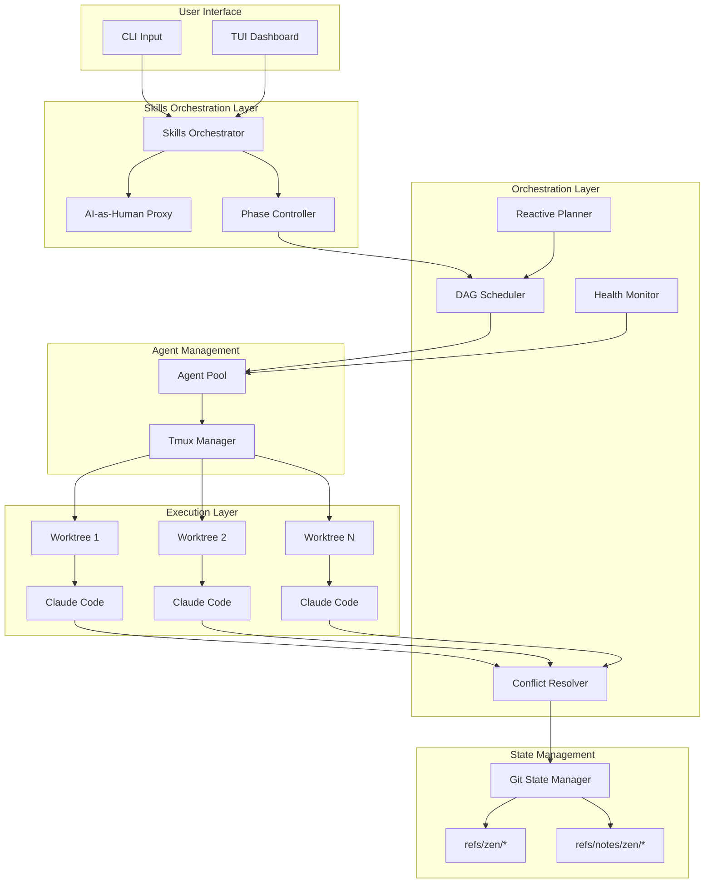

# Zen Architecture

> A parallel AI agent orchestrator that transforms natural language prompts into implemented code through concurrent Claude Code agents.

**Related docs:**
- [Skills Integration](./skills-integration.md) - Skills workflow, AI-as-Human pattern
- [Game Loop Architecture](./game-loop-architecture.md) - Two-thread design, state snapshotting
- [TEA Pattern](./tea-pattern.md) - Model, Message, Command, update function
- [Actor System](./actors.md) - Background tasks
- [Async Patterns](./async-patterns.md) - Tokio integration
- [UI Design](./ui-design.md) - Rendering strategy
- [Data Model](./data-model.md) - State and persistence

---

## System Overview

Zen orchestrates multiple Claude Code agents working in parallel across git worktrees, with AI-driven dependency inference, automatic conflict resolution, and a reactive planning system.



### Workflow Phases

Zen executes workflows through five sequential phases:

```
Phase 1: Planning (/pdd)
    └─► Phase 2: Task Generation (/code-task-generator)
        └─► Phase 3: Implementation (/code-assist) ─ Parallel Agents
            └─► Phase 4: Merging (Conflict Resolution)
                └─► Phase 5: Documentation (/codebase-summary) [Optional]
```

---

## Design Principles

1. **100% Safe Rust** - No `unsafe` blocks. Leverage the type system.
2. **Decoupled Game Loop** - Two threads, independent clocks, zero blocking.
3. **Zero-Cost Abstractions** - Traits and generics over dynamic dispatch in hot paths.
4. **Minimal Allocations** - Reuse buffers, avoid cloning in render loops.
5. **Clean Separation** - Each module owns its domain completely.
6. **Fail Fast** - Propagate errors early, crash on unrecoverable states.

---

## Thread Architecture

Zen uses a two-thread architecture with orchestration extensions:

```
┌──────────────────────────────────────────────────────────────────────────────┐
│                    Decoupled Game Loop + Orchestration                        │
│                                                                               │
│  ┌─────────────────────────┐       ┌────────────────────────────────────────┐│
│  │     Main Thread         │       │           Logic Thread                  ││
│  │     (Render Loop)       │       │         (Tokio Runtime)                 ││
│  │                         │       │                                         ││
│  │  ┌─────────────────┐    │       │  ┌────────────────────────┐             ││
│  │  │    Terminal     │    │       │  │   Keyboard Polling     │             ││
│  │  │   (Ratatui)     │    │       │  │   (Zero Timeout)       │             ││
│  │  └─────────────────┘    │       │  └────────────────────────┘             ││
│  │          ▲              │       │            │                            ││
│  │          │              │       │            ▼                            ││
│  │  ┌─────────────────┐    │       │  ┌────────────────────────┐             ││
│  │  │  RenderState    │◄───┼───────┼──│   TEA Update Loop      │             ││
│  │  │  (Snapshot)     │    │       │  │   Model + Message =    │             ││
│  │  └─────────────────┘    │       │  │   Commands             │             ││
│  │                         │       │  └────────────────────────┘             ││
│  │  60 FPS Cap             │       │            │                            ││
│  │  On-Change Render       │       │            ▼                            ││
│  │                         │       │  ┌────────────────────────┐             ││
│  └─────────────────────────┘       │  │   Background Actors    │             ││
│                                    │  │   - Preview (250ms)    │             ││
│                                    │  │   - Diff (1000ms)      │             ││
│                                    │  │   - Prompt (500ms)     │             ││
│                                    │  │   - Health (5000ms)    │             ││
│                                    │  └────────────────────────┘             ││
│                                    │            │                            ││
│                                    │            ▼                            ││
│                                    │  ┌────────────────────────┐             ││
│                                    │  │  Skills Orchestrator   │             ││
│                                    │  │  - Phase Controller    │             ││
│                                    │  │  - AI-as-Human Proxy   │             ││
│                                    │  │  - DAG Scheduler       │             ││
│                                    │  └────────────────────────┘             ││
│                                    │            │                            ││
│                                    │            ▼                            ││
│                                    │  ┌────────────────────────────────────┐ ││
│                                    │  │        Agent Pool                  │ ││
│                                    │  │  ┌──────┐ ┌──────┐ ┌──────┐        │ ││
│                                    │  │  │Agent1│ │Agent2│ │AgentN│        │ ││
│                                    │  │  │Monitor│ │Monitor│ │Monitor│       │ ││
│                                    │  │  └──────┘ └──────┘ └──────┘        │ ││
│                                    │  └────────────────────────────────────┘ ││
│                                    └────────────────────────────────────────┘│
└──────────────────────────────────────────────────────────────────────────────┘
```

**Thread Responsibilities:**
- **Main Thread**: 60 FPS render loop, terminal I/O (no blocking)
- **Logic Thread**: Tokio runtime, TEA updates, command execution, orchestration
- **Agent Monitors**: Per-agent output capture and health monitoring (spawned as needed)

---

## Module Overview

```
zen/
├── src/
│   ├── main.rs              # Entry point, CLI parsing, render loop
│   ├── lib.rs               # Module exports
│   ├── app.rs               # Logic thread, event coordination
│   ├── render.rs            # RenderState snapshots, version tracking
│   ├── ui.rs                # TUI rendering (dashboard, agent grid, DAG)
│   ├── cleanup.rs           # Worktree and resource cleanup
│   │
│   ├── core/                # Core domain models
│   │   ├── mod.rs
│   │   ├── task.rs          # Task model with lifecycle
│   │   ├── dag.rs           # TaskDAG with petgraph
│   │   └── code_task.rs     # .code-task.md parser
│   │
│   ├── workflow/            # Workflow state management
│   │   ├── mod.rs
│   │   ├── types.rs         # WorkflowId, Phase, Status, Config
│   │   └── state.rs         # WorkflowState with phase transitions
│   │
│   ├── orchestration/       # Orchestration layer
│   │   ├── mod.rs
│   │   ├── skills.rs        # SkillsOrchestrator, PhaseController
│   │   ├── ai_human.rs      # AIHumanProxy for autonomous Q&A
│   │   ├── pool.rs          # AgentPool, AgentHandle
│   │   ├── scheduler.rs     # DAG-based parallel scheduler
│   │   ├── resolver.rs      # ConflictResolver for merges
│   │   ├── health.rs        # HealthMonitor, RecoveryAction
│   │   ├── planner.rs       # ReactivePlanner, file watching
│   │   ├── claude.rs        # ClaudeHeadless executor
│   │   └── detection.rs     # Question detection patterns
│   │
│   ├── state/               # Git-native state persistence
│   │   ├── mod.rs
│   │   ├── manager.rs       # GitStateManager
│   │   └── migration.rs     # State migration tool
│   │
│   ├── tea/                 # TEA pattern (The Elm Architecture)
│   │   ├── mod.rs
│   │   ├── model.rs         # Application state
│   │   ├── message.rs       # Input events
│   │   ├── command.rs       # Side effects
│   │   └── update.rs        # Pure update function
│   │
│   ├── git.rs               # GitOps, GitRefs, GitNotes
│   ├── tmux.rs              # Tmux session management
│   ├── agent.rs             # Agent abstraction, AgentId, AgentStatus
│   ├── session.rs           # Session CRUD operations
│   ├── config.rs            # Configuration loading
│   └── error.rs             # Error types
│
├── tests/
│   └── integration/         # E2E, performance, parallel tests
├── docs/                    # Architecture documentation
└── Cargo.toml
```

---

## Component Descriptions

### Skills Orchestration Layer

| Component | Module | Purpose |
|-----------|--------|---------|
| **SkillsOrchestrator** | `orchestration/skills.rs` | Coordinates the 5-phase workflow (PDD → TaskGen → Impl → Merge → Docs) |
| **AIHumanProxy** | `orchestration/ai_human.rs` | Autonomously answers skill clarification questions on behalf of user |
| **PhaseController** | `orchestration/skills.rs` | Manages phase transitions with validation and event emission |

### Orchestration Layer

| Component | Module | Purpose |
|-----------|--------|---------|
| **Scheduler** | `orchestration/scheduler.rs` | DAG-based parallel task execution with dependency respect |
| **ReactivePlanner** | `orchestration/planner.rs` | Watches plan files for changes and updates DAG dynamically |
| **ConflictResolver** | `orchestration/resolver.rs` | AI-assisted merge conflict resolution with dedicated resolver agent |
| **HealthMonitor** | `orchestration/health.rs` | Detects stuck agents and determines recovery actions |

### Agent Management

| Component | Module | Purpose |
|-----------|--------|---------|
| **AgentPool** | `orchestration/pool.rs` | Manages agent lifecycle (spawn, monitor, terminate) with capacity limits |
| **AgentHandle** | `orchestration/pool.rs` | Communication interface for agents (send commands, read output) |
| **ClaudeHeadless** | `orchestration/claude.rs` | Executes Claude Code in headless mode with JSON parsing |

### State Management

| Component | Module | Purpose |
|-----------|--------|---------|
| **GitStateManager** | `state/manager.rs` | Unified interface for git-native state persistence |
| **GitRefs** | `git.rs` | Manages refs/zen/* for workflow/task references |
| **GitNotes** | `git.rs` | Stores JSON metadata in refs/notes/zen/* |
| **GitOps** | `git.rs` | Worktree CRUD, branch operations, diff computation |

### Core Models

| Model | Module | Purpose |
|-------|--------|---------|
| **Workflow** | `workflow/types.rs` | Complete workflow state with config and lifecycle |
| **WorkflowState** | `workflow/state.rs` | Phase tracking with transition validation |
| **Task** | `core/task.rs` | Single unit of work with status and execution context |
| **TaskDAG** | `core/dag.rs` | Dependency graph using petgraph DiGraph |
| **CodeTask** | `core/code_task.rs` | Parsed .code-task.md file with metadata |

---

## Module Responsibilities

### `main.rs` - Entry Point & Render Thread

**Purpose:** Bootstrap the application and run the pure render loop.

**Responsibilities:**
- Parse CLI arguments
- Initialize terminal (raw mode, alternate screen)
- Spawn the logic thread with Tokio runtime
- Run the render loop at 60 FPS
- Coordinate shutdown
- Restore terminal on exit

```rust
fn main() -> Result<()> {
    // Initialize logging
    zen::log::init();

    // Load configuration
    let config = Config::load()?;

    // Shared shutdown signal
    let shutdown = Arc::new(AtomicBool::new(false));

    // State channel (bounded(1) = latest-wins)
    let (state_tx, state_rx) = crossbeam_channel::bounded::<RenderState>(1);

    // Spawn logic thread
    let logic_handle = thread::spawn(move || {
        LogicThread::run(config, state_tx, shutdown.clone())
    });

    // Initialize terminal (main thread owns it)
    let mut terminal = setup_terminal()?;

    // Run render loop
    let result = render_loop(&mut terminal, state_rx, &shutdown);

    // Clean shutdown
    shutdown.store(true, Ordering::SeqCst);
    let _ = logic_handle.join();
    restore_terminal(&mut terminal)?;

    result
}
```

See [Game Loop Architecture](./game-loop-architecture.md) for details.

### `app.rs` - Logic Thread

**Purpose:** Handle all state mutations, input processing, and actor coordination.

**Responsibilities:**
- Run the Tokio async runtime
- Poll keyboard input (synchronous, zero timeout)
- Execute TEA update function
- Execute commands (spawn async tasks)
- Send state snapshots to render thread
- Manage background actors

```rust
impl LogicThread {
    async fn run_async(config: Config, state_tx: Sender<RenderState>, shutdown: Arc<AtomicBool>) -> Result<()> {
        let mut model = Model::load(config, agent).await?;
        let (msg_tx, mut msg_rx) = mpsc::unbounded_channel::<Message>();
        let actors = spawn_actors(msg_tx.clone(), session_info.clone());

        loop {
            // PHASE 1: Keyboard (highest priority)
            while event::poll(Duration::ZERO)? {
                // Process immediately via TEA update
            }

            // PHASE 2: Background messages (bounded drain)
            while let Ok(msg) = msg_rx.try_recv() {
                // Process up to MAX_BG_MESSAGES_PER_TICK
            }

            // Send state snapshot if dirty
            if model.dirty {
                send_state(&state_tx, &model);
                model.dirty = false;
            }

            // PHASE 3: Yield
            tokio::time::sleep(Duration::from_micros(500)).await;
        }
    }
}
```

### `tea/` - The Elm Architecture

**Purpose:** Pure state management with message-driven updates.

- **model.rs** - Application state (sessions, caches, mode)
- **message.rs** - Input events (keyboard, actor updates, task completion)
- **command.rs** - Side effects (create session, save state, quit)
- **update.rs** - Pure function: `(Model, Message) -> Commands`

See [TEA Pattern](./tea-pattern.md) for details.

### `render.rs` - State Snapshots

**Purpose:** Immutable snapshots for the render thread.

```rust
pub struct RenderState {
    pub version: u64,              // Change detection
    pub sessions: Vec<SessionView>,
    pub selected: usize,
    pub mode: Mode,
    pub preview: Option<String>,
    pub diff: Option<(DiffStats, String)>,
    // ...
}
```

### `actors/` - Background Tasks

**Purpose:** Independent polling tasks that send messages.

- **preview.rs** - Capture tmux pane content (250ms)
- **diff.rs** - Compute git diff stats (1000ms)
- **prompt.rs** - Detect agent prompts (500ms)

See [Actor System](./actors.md) for details.

### `session.rs` - Session Management

**Purpose:** CRUD operations for coding sessions.

```rust
pub struct Session {
    pub id: SessionId,
    pub name: String,
    pub project: String,
    pub branch: String,
    pub base_branch: String,
    pub base_commit: String,
    pub model: String,
    pub status: SessionStatus,
    pub worktree_path: Option<PathBuf>,
    pub created_at: DateTime<Utc>,
    pub last_active: DateTime<Utc>,
}

pub enum SessionStatus {
    Running,
    Paused,
}
```

### `git.rs` - Git Operations

**Purpose:** All git interactions via `git2` crate.

```rust
impl GitOps {
    pub fn create_worktree(&self, branch: &str) -> Result<PathBuf>;
    pub fn remove_worktree(&self, path: &Path) -> Result<()>;
    pub fn diff_stats(&self, worktree: &Path) -> Result<DiffStats>;
    pub fn diff_content(&self, worktree: &Path) -> Result<String>;
}
```

### `tmux.rs` - Terminal Multiplexer

**Purpose:** Manage tmux sessions for agent terminals.

```rust
impl Tmux {
    pub fn create_session(name: &str, cwd: &Path, cmd: &[&str]) -> Result<()>;
    pub fn kill_session(name: &str) -> Result<()>;
    pub fn capture_pane(name: &str) -> Result<String>;  // With ANSI
    pub fn capture_pane_plain(name: &str) -> Result<String>;  // Without ANSI
    pub fn attach(name: &str) -> Result<()>;
    pub fn session_exists(name: &str) -> bool;
    pub fn session_attached(name: &str) -> Result<String>;
}
```

### `agent.rs` - Agent Abstraction

**Purpose:** Trait-based agent support.

```rust
pub trait Agent: Send + Sync {
    fn name(&self) -> &'static str;
    fn binary_name(&self) -> &'static str;
    fn command(&self, cwd: &Path, prompt: Option<&str>) -> Vec<String>;
    fn auto_yes_flag(&self) -> Option<&str> { None }
    fn prompt_pattern(&self) -> Option<&str> { None }
}
```

See [Agents](./agents.md) for full design.

### `config.rs` - Configuration

**Purpose:** Load user preferences.

```rust
#[derive(Debug, Deserialize, Default)]
pub struct Config {
    #[serde(default)]
    pub agent: AgentKind,
    #[serde(default)]
    pub auto_yes: bool,
}
```

### `error.rs` - Error Types

**Purpose:** Unified error handling.

```rust
#[derive(Error, Debug)]
pub enum Error {
    #[error("IO error: {0}")]
    Io(#[from] std::io::Error),
    #[error("Git error: {0}")]
    Git(#[from] git2::Error),
    #[error("Tmux error: {0}")]
    Tmux(String),
    #[error("Timeout")]
    Timeout,
    // ...
}
```

---

## Data Flow

```
┌─────────────────────────────────────────────────────────────────────┐
│                         Data Flow                                    │
│                                                                      │
│  ┌─────────┐    ┌─────────────┐    ┌─────────────┐    ┌──────────┐ │
│  │Keyboard │───►│ Message::   │───►│  update()   │───►│ Commands │ │
│  │ Event   │    │ Key(event)  │    │             │    │          │ │
│  └─────────┘    └─────────────┘    └──────┬──────┘    └────┬─────┘ │
│                                           │                 │       │
│  ┌─────────┐    ┌─────────────┐           │                 │       │
│  │  Actor  │───►│ Message::   │           │                 │       │
│  │ Output  │    │ XxxUpdated  │───────────┘                 │       │
│  └─────────┘    └─────────────┘                             │       │
│                                                             ▼       │
│  ┌─────────┐    ┌─────────────┐    ┌─────────────┐    ┌──────────┐ │
│  │  Task   │───►│ Message::   │───►│ execute()   │◄───│ Commands │ │
│  │Complete │    │SessionXxx   │    │  (async)    │    │          │ │
│  └─────────┘    └─────────────┘    └─────────────┘    └──────────┘ │
│                                                                      │
│                       Model.dirty = true                             │
│                              │                                       │
│                              ▼                                       │
│  ┌─────────────┐    ┌─────────────┐    ┌─────────────────────────┐ │
│  │   Model     │───►│  snapshot() │───►│  RenderState (channel)  │ │
│  │   State     │    │             │    │                         │ │
│  └─────────────┘    └─────────────┘    └────────────┬────────────┘ │
│                                                      │              │
│                                                      ▼              │
│                                         ┌─────────────────────────┐ │
│                                         │   Render Thread (60fps) │ │
│                                         │   terminal.draw()       │ │
│                                         └─────────────────────────┘ │
└─────────────────────────────────────────────────────────────────────┘
```

---

## Startup Sequence (< 50ms target)

```
1. Parse CLI args                     ~1ms
2. Initialize logging                 ~1ms
3. Load config (JSON parse)           ~2ms
4. Spawn logic thread                 ~1ms
   a. Create Tokio runtime            ~2ms
   b. Load state (JSON parse)         ~5ms
   c. Initialize model                ~2ms
   d. Spawn actors                    ~1ms
5. Initialize terminal                ~5ms
6. First render                       ~10ms
─────────────────────────────────────
Total                                 ~30ms
```

---

## Key Architectural Decisions

### Two-Thread Design

| Traditional | Zen |
|-------------|-----|
| Single event loop | Main (render) + Logic (Tokio) |
| Render waits for I/O | Threads independent |
| Input feels laggy | Input instant (~0.1ms) |

### State Communication

| Approach | Problem | Zen Solution |
|----------|---------|--------------|
| Shared mutex | Contention, blocking | Immutable snapshots |
| Unbounded channel | Memory growth | Bounded(1), latest-wins |
| Arc<RwLock> | Read contention | Clone-on-send |

### Input Processing

| Approach | Latency | Zen Choice |
|----------|---------|------------|
| Async EventStream | ~1-5ms | No |
| Sync poll(ZERO) | ~0.1ms | Yes |

### Background Work

| Approach | Problem | Zen Solution |
|----------|---------|--------------|
| Inline in loop | Blocks input | Actors on intervals |
| Spawn per-request | Too many tasks | Fixed actor count |
| Unbounded processing | Starves input | Bounded drain |

### Git-Native State Management

All orchestration state is stored in git refs and notes for portability and versioning:

```
refs/zen/
├── workflows/
│   └── {workflow-id}          # Points to workflow commit
├── tasks/
│   └── {task-id}              # Points to task branch HEAD
└── staging                    # Staging branch for completed work

refs/notes/zen/
├── workflows/                 # Workflow metadata (JSON)
├── tasks/                     # Task metadata (JSON)
└── agents/                    # Agent session metadata (JSON)
```

**Benefits:**
- Portable - state travels with the repository
- Versioned - full history of all state changes
- No external dependencies - no database required
- Git-native tooling works (reflog, gc, etc.)

---

## Dependencies

```toml
[dependencies]
# TUI
ratatui = "0.28"
crossterm = "0.28"

# Async runtime
tokio = { version = "1", features = ["rt", "sync", "time", "process"] }
tokio-util = "0.7"

# Channels
crossbeam-channel = "0.5"

# Git
git2 = "0.19"

# CLI
clap = { version = "4", features = ["derive"] }

# DAG
petgraph = "0.6"

# File watching
notify = "6"

# Serialization
serde = { version = "1", features = ["derive"] }
serde_json = "1"

# Error handling
thiserror = "1"

# Time
chrono = { version = "0.4", features = ["serde"] }

# Regex
regex = "1"

# Utilities
dirs = "5"
uuid = { version = "1", features = ["v4"] }
which = "6"
```

---

## Performance Considerations

1. **Render path:** Borrow state immutably, no allocations in draw methods
2. **Input path:** Synchronous polling, zero timeout, immediate processing
3. **Background work:** Actors on intervals, bounded drain
4. **State transfer:** Immutable snapshots, version-tracked, latest-wins
5. **Git operations:** Run in spawn_blocking, timeout protected

---

## Security Considerations

1. **No arbitrary code execution** - Agent commands are constructed, not interpolated
2. **Path sanitization** - All paths validated before use
3. **No secrets in state** - Only session metadata persisted
4. **Tmux session isolation** - Each session in separate tmux session
5. **Timeout protection** - All external operations have timeouts

---

## Testing Strategy

1. **TEA update function** - Pure function, extensive unit tests
2. **State snapshots** - Version tracking, change detection
3. **Channel semantics** - Latest-wins, non-blocking
4. **Actor isolation** - Each actor testable independently
5. **Integration tests** - E2E workflow tests, parallel agent tests
6. **Performance tests** - 60 FPS render, scheduler overhead, memory baseline

### Test Categories

| Category | Scope | Location |
|----------|-------|----------|
| Unit Tests | Individual functions, data structures | `src/**/*.rs` (inline) |
| Integration Tests | Component interactions, E2E workflows | `tests/integration/` |
| Performance Tests | Timing, memory, concurrency | `tests/integration/performance.rs` |

Run tests with:
```bash
cargo test                    # All unit tests
cargo test --test integration # Integration tests only
cargo test workflow           # Workflow-related tests
```
